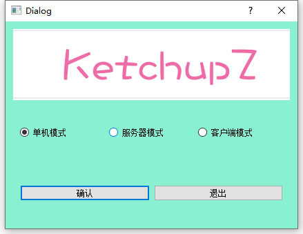
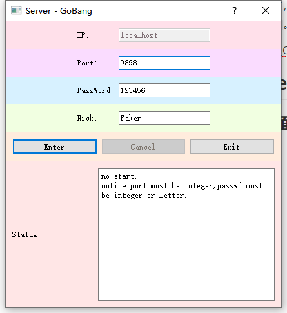
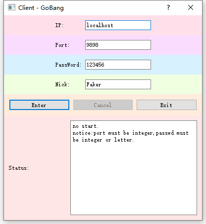
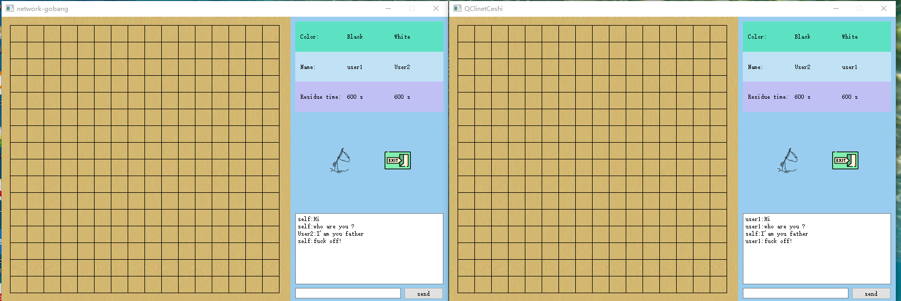

# network-gobang
基于QT开发的五子棋。支持本地模式和联网模式。

**本地模式**包括双人模式和人机模式。

**网络模式**可以选择服务器端来创建房间，使用客户端来连接服务器进入房间，开始游戏之后可以通过聊天框进行远程聊天。

##  introduction

这是基于之前的[Gobang-high-](https://github.com/LieLieLiekey/Gobang-high-)项目开发的五子棋，之前的项目使用了MVC设计模式思想进行架构，所以进化到这个项目时，只是换了个Control，原项目的model，view和control接口都没有改变，并直接就使用。

但是开发网络模式还是有很大的劳动量的，新项目增加的类数目大概接近原项目类数目：增加了两个接口，七个具体类。开发期间也遇到了很多问题，但是在编程方面问题不大，基本上看官网文档和Google就可以轻松解决，但是在设计框架和处理异常方面是最困扰我的。

虽然该项目还有许多地方可以改进，但是基本功能和异常处理都已经完成，基于现在没有空闲时间情况下，项目更新周期应该会很长。

另外一个遗憾的地方是UI界面只是简单的设计了一下，欢迎项目中的修改UI界面！

对于**本地模式**就不介绍了，详情看[Gobang-high-](https://github.com/LieLieLiekey/Gobang-high-)项目的README文档。

## Usage

项目采用`C++`语言，使用QT库开发，基于的Kits是`Desktop Qt 5.9.9 MSVC2019 64bit`，使用`qmake`构建，`c++`标准为`c++11`。程序入口在`main.cpp`内。

该项目可直接通过Qt Creator进行项目导入。

## The game picture

### 选择模式界面

### 服务器创建界面

### 客户端连接界面

### 游戏开始界面

这是在本地上运行的客户端和服务器

### 其他

包含投降、退出等功能。

## detail

待补充...

## Scheme

架构是当前目录下的`network-scheme.draw.io`文件

## final

### 还需要修改的BUG(不严重)

#### close对象但无法真正退出

在关闭界面时，是使用的`close`函数，它会关闭`QFrame`、`QWidget`或`QDialog`的界面，但这里的close是暂时隐藏，实际还是事件循环中。这样就导致在刚开始new对象，因为`QApplicaition.exec`函数不能返回导致不能被delete掉。

#### 计时器没有网络同步

因为在游戏界面的计时器，并没有进行网络同步，导致在网络较差的情况下两方的计时器时间不同，甚至相差非常大，从而导致一方提前判断游戏结束，接着断开连接，而另一方看到的场景是对方迟迟不下棋或断开连接。